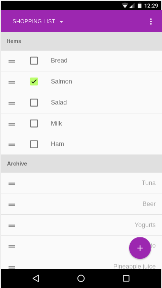

# OWLS

*Offline Web Shopping List*. [IN DEVELOPMENT]

OWLS is a full webapp made for learning purposes that will be able to:
- Store several **lists of items**
- Mark every item as **done** or not done
- **Archive** an item to the back of the list for later easy retrieval
- Keep on working while you are out of connection, as in my supermarket, because it **stores all the data in your device**
- Help you do all that superfast: **Swipe** those items off to the archive!

Sample of the current state of the app:

## Why web instead of Android?

For personal requirements. The purpose of developing this app is to improve my web development skills with Node and Angular, the involved workflows and modularization, as well as being forced to use amazing modules to make the app awesome, as angular-material and localForage.

Mostly for personal use, I plan on releasing the app in a public domain, however you are free to use it as you please!

If you find a bug, don't get too emotionally attached, because I will eventually kill it without compassion.
