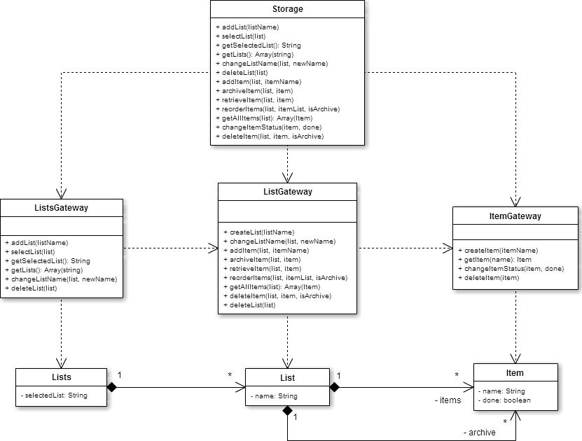

# Services

## Error Manager

A service used to push notifications to the user in case of internal error, 
and resolve callbacks to allow the execution to continue. These callbacks will 
receive one attribute with a value of null.

```javascript
ErrorManager:
	function error(err, callback);
```

## Storage

The app's device storage is done through the service 'storage'. It uses the library [LocalForage](http://mozilla.github.io/localForage) and acts as a facade controller for the rest of the storage services.

The other storage services (listsGateway, listGateway and itemGateway) implement a Table Data Gateway pattern as depicted here:

